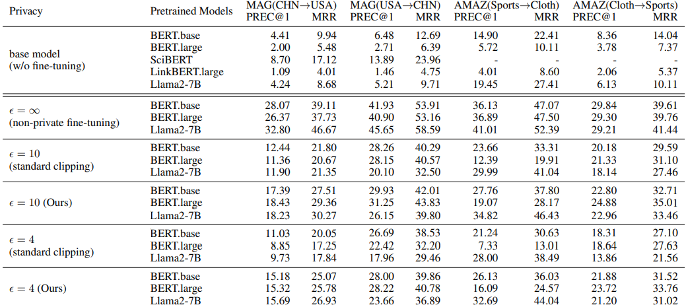
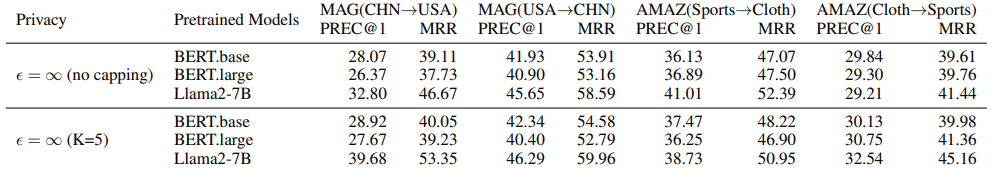

# Differentially Private Relational Learning with Entity-level Privacy Guarantees

NeurIPS 2025

講者：林穎沛
日期：2026-03-13

---

## 大綱

1. 研究動機
2. 背景
3. 挑戰
4. 方法
5. 實驗結果
6. 討論

---

## 研究動機

- 許多資料具有關聯結構
  - 社群網路（使用者關係）
  - 學術圖譜（作者、論文）
- 問題：一個實體通常參與多個關係，若模型記住這些關係，可能導致隱私洩漏
- 目標：在關聯式學習中，提供實體級別的差分隱私保護

---

## 背景 1

- 現有的 DP-GNNs:
  - 節點標籤預測任務
  - 隱私防護聚焦於節點特徵
  - 為何不適用：在關聯性學習中，隱私風險在於關係 (邊)，來源不同

- 現有的隱私放大理論:
  - 假設資料樣本彼此獨立
  - 為何不適用：使用耦合採樣，正負樣本之間會存在相關性，違反獨立假設

---

## 背景 2

- 現有的梯度下降方法：
  - Mini-batch SGD: 使用小批次資料計算平均梯度更新模型，容易記住並洩漏單一訓練資料
  - DP-SGD: 標準的隱私保護訓練機制，步驟包含隱私放大、單一樣本梯度裁剪、添加高斯噪音

---

## 挑戰

- 高敏感度
  - 若一個節點參與多個關係，移除它會同時改變多個梯度項，DP-SGD 會添加大量高斯噪音來掩蓋這些變化，導致模型性能大幅下降
- 耦合採樣
  - 正樣本和負樣本之間存在相關性，數學前提、隨機性被破壞，使得 DP-SGD 的隱私放大效果降低

---

## 方法 1：不放回負採樣

- 目的：解開耦合採樣
- Algorithm 2, NEG-SAMPLE-WOR
- 流程：
  - 抽出一批數量的正樣本後，不看它們具體連到誰
  - 回到全域的節點池中，不放回地隨機抽出對應數量的節點
  - 與正樣本的其中一端配對形成一組負樣本
- 效果：
  - 負樣本的抽取只受正樣本的數量影響，不受正內容的影響，降低了敏感度
  - 因為是不放回抽樣，保證了任一節點，在同一個 Batch 的負樣本中最多只會出現一次

---

## 方法 2: 頻率自適應梯度裁剪

- 目的：控制高敏感度
- Algorithm 1, FREQ-CLIP
- 流程：
  - 在每個 Batch 中，統計每個節點出現的頻率
  - 根據頻率調整該節點對應的梯度裁剪閾值
  - 出現頻率越高的節點，裁剪閾值越小，從而限制其對整體梯度的影響
- 效果：
  - 限制單一節點對整體梯度的影響
  - 無論一個節點有多活躍，移除它所造成的總梯度變化量（局部敏感度），都能被限制在一個常數範圍內

---

## 完整訓練框架

- 前置處理：節點度數限制 $K$
  - 訓練前限制最大節點度數，減輕超級節點造成的極端影響。
  
- 流程
  1. 正樣本：透過 Poisson 抽樣抽取
  2. 負樣本：透過 NEG-SAMPLE-WOR 不放回抽取 (方法 1)
  3. 算梯度：透過 FREQ-CLIP 進行自適應梯度裁剪 (方法 2)
  4. 注入高斯噪音
  5. 更新模型參數

---

## 實驗

- 在文本屬性圖上進行關聯預測
- 資料集：MAG、Amazon
- 微調預訓練模型：BERT、Llama2
- 評估指標：MRR、PREC@1

---

## 結果 1

- 在嚴格隱私預算下 $\epsilon \in \{4, 10\}$，預測表現仍明顯優於標準梯度裁剪

---

## 結果 2

- 加入節點度數限制 $K$
- 即使在無隱私訓練，效能仍優於不設限制的模型
- 原因：降低大節點的權重，防止模型過擬合，提升了對普通節點的泛化能力

---

## 侷限

- 節點度數限制會丟棄高維度節點的結構資訊
- 全域隨機配對可能產生假負樣本
- 缺乏有助於對比學習的困難樣本
- 目前僅有節點出現頻率的裁剪，尚未涵蓋更廣泛的函數設計

---

## 未來

- 設計更通用的自適應梯度裁剪函數
- 改進負樣本抽樣策略
- 耦合採樣下的隱私放大理論
